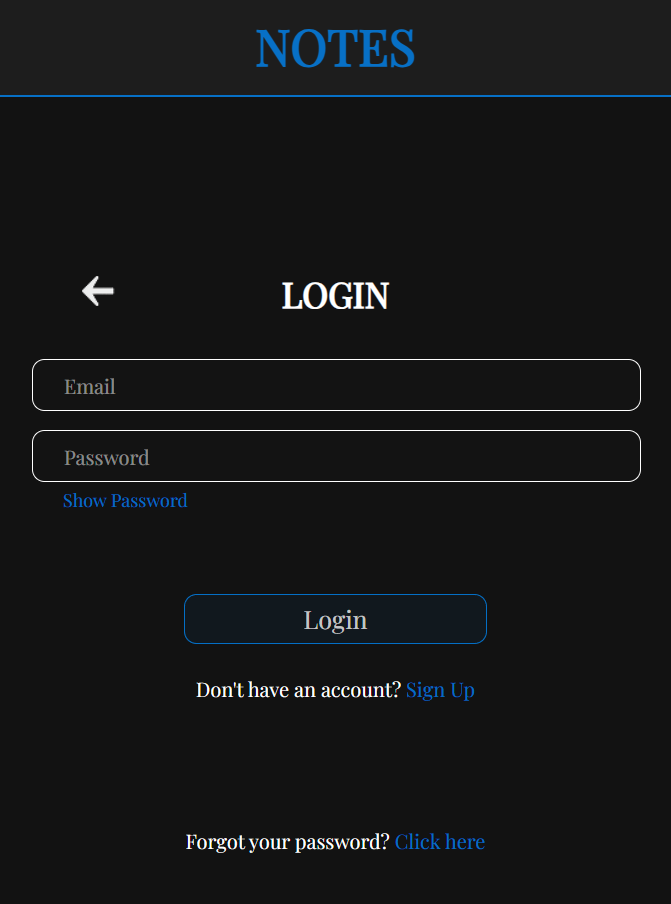

# MERN Notes App 
Created by [Donovan Heynen](https://donovanheynen.com/)

A full-stack notes management application built with the **MERN stack** that lets users securely create, organize, and manage notes — accessible on any device.

---
## [Visit Live Website 🌐](https://notes-mern-app.pages.dev/)


---

## Features
- **User Authentication** – Secure sign-up and login with JWT.
- **Password Recovery** - Includes password recovery through email using [Resend](https://resend.com/) and JWT
- **Full CRUD Operations** – Create, read, update, and delete notes.
- **Responsive Design** – UI built for mobile, tablet, and desktop.
- **Cloud Database** – Powered by MongoDB Atlas.

---

## Tech Stack
- **Frontend:** React.js
- **Backend:** Node.js, Express.js  
- **Database:** MongoDB Atlas (Non-relational)
- **Authentication:** JSON Web Tokens (JWT), bcrypt  
- **Hosting:** Cloudflare Pages (Frontend), Render (Backend)

---

## Screenshots
| Login | Dashboard | Edit Note |
|-------|-----------|------------|
|  |   |   |

---

## Local Setup

### 1️⃣ Clone the repository
```bash
git clone https://github.com/heynendo/notes-MERN-app.git
cd notes-MERN-app
```
### 2️⃣ Install Dependencies
```bash
# Install server dependencies
cd backend
npm install

# Install client dependencies
cd ../frontend
npm install
```

### 3️⃣ Create environment variables
- Create .env files in both backend and frontend directories.
```bash
# backend
PORT=5000
MONGO_URI=your_mongodb_connection_string
JWT_SECRET=your_secret_key
RESEND_API_KEY=your_resend_key
BACKEND_URL=your_backend_url
FRONTEND_URL=your_frontend_url
# frontend
VITE_BACKEND_URL=your_backend_url
VITE_FRONTEND_URL=your_frontend_url
```

### 4️⃣ Run the app
```bash
# Run backend
cd backend
npm run dev

# Run frontend (in a separate terminal)
cd frontend
npm start
```
